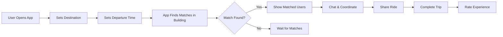
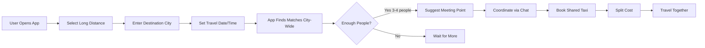

# ShareTaxi - Core Concept & Vision

## 🎯 The Big Idea

ShareTaxi is a **peer-to-peer ride sharing platform** that connects people going to the same destination, enabling them to travel together and share costs. Unlike Ola/Uber (commercial taxi services), this is a **community-based sharing platform** where regular people help each other travel.

---

## 🚗 Two Primary Use Cases

### Use Case 1: Hyper-Local Rides (Short Distance)

**Scenario**: People in the same building/society going to nearby places

**Example**:
- You live in XYZ Apartments
- You want to go to Ramdhawa (nearby area)
- Your neighbor is also going to Ramdhawa in their car
- The app connects you both
- You share the ride and optionally split fuel costs

**Key Characteristics**:
- ✅ Same building/society/locality
- ✅ Short distance (typically < 10 km)
- ✅ One person has a car, others join
- ✅ Hyper-local community building
- ✅ Privacy: Only building residents see each other

**Matching Criteria**:
- Same building/society
- Destination within 2 km radius
- Departure time within 15 minutes
- Available seats in the car

---

### Use Case 2: Long Distance Shared Taxi

**Scenario**: People from different areas going to the same far destination

**Example**:
- You're in Ramdhawa and want to go to Rajkot (far city)
- Someone in another area also wants to go to Rajkot
- 2-3 more people from different locations also want to go
- The app connects all of you
- You book ONE taxi together and split the cost
- You meet at a convenient point and travel together

**Key Characteristics**:
- ✅ Long distance (> 50 km, inter-city)
- ✅ People from different areas/localities
- ✅ Shared taxi/cab booking
- ✅ Significant cost savings (₹2000 ÷ 4 = ₹500 per person)
- ✅ City-wide or region-wide matching

**Matching Criteria**:
- Same destination city/area
- Similar departure date/time
- Willing to share taxi
- Reasonable meeting point

---

## 🔄 How It Works (User Flow)

### For Short Distance Rides



### For Long Distance Rides



---

## 🤖 Automatic Detection vs Manual Input

### Current Understanding (Needs Clarification)

**Option A: Automatic Detection** (Like Ola/Uber drivers)
- App automatically detects when user is traveling
- Uses GPS to track movement
- Shows "This person is currently going to Ramdhawa"
- ⚠️ **Privacy Concern**: Always-on tracking

**Option B: Manual Declaration** (Recommended)
- User manually says "I'm going to Ramdhawa at 5 PM"
- App matches with others who declared similar trips
- No constant tracking
- ✅ **Privacy Friendly**: Opt-in for each trip

**Developer Note**: We recommend Option B for MVP. Automatic detection can be added later with explicit user consent.

---

## 💰 Payment & Cost Sharing

### Key Principle: **Non-Commercial**

This is NOT a commercial taxi service. It's peer-to-peer cost sharing.

### Payment Options

**Option 1: No In-App Payment** (Simplest)
- Users handle money privately (cash, UPI, etc.)
- App only facilitates connection
- ✅ **Legal Safety**: No payment processing liability

**Option 2: Optional In-App Payment** (Future)
- Users can send money to ride partners
- "Send ₹50 for fuel sharing"
- Requires payment gateway integration
- ⚠️ **Legal Complexity**: May need licenses

**Option 3: Cost Calculator Only**
- App calculates suggested split
- "Estimated cost: ₹200, Split 2 ways = ₹100 each"
- No actual payment processing
- ✅ **Helpful + Safe**

**Recommendation for MVP**: Option 3 (Calculator only)

---

## 🎯 Core Features

### Must-Have (MVP)

1. **User Authentication**
   - Phone number verification
   - Building/locality verification
   - User profile

2. **Trip Creation**
   - Set destination
   - Set departure time
   - Choose trip type (local/long distance)
   - Set available seats (for car owners)

3. **Smart Matching**
   - Real-time matching algorithm
   - Different rules for local vs long distance
   - Instant notifications

4. **Communication**
   - In-app chat
   - Quick actions ("I'm ready", "Running late")
   - Contact sharing (optional)

5. **Map Integration**
   - Show matched users
   - Display routes
   - Suggest meeting points

6. **Trip Coordination**
   - Trip status tracking
   - Meeting point confirmation
   - Trip completion

7. **Trust & Safety**
   - User ratings
   - Reviews
   - Trip history
   - Emergency contacts

### Nice-to-Have (Post-MVP)

1. **AI-Powered Features**
   - Smart route optimization
   - Pattern detection (regular commutes)
   - Predictive matching
   - Optimal meeting point suggestions

2. **Recurring Trips**
   - Daily office commute
   - Weekly grocery runs
   - Regular carpool groups

3. **Group Trips**
   - 3+ people coordination
   - Group chat
   - Shared itinerary

4. **Payment Integration**
   - In-app cost splitting
   - Automatic fare calculation
   - Payment history

---

## 🔒 Privacy & Safety

### Privacy Principles

1. **Hyper-Local Privacy**
   - Location visible ONLY to verified building residents (for local rides)
   - Wider visibility only for long-distance trips (with consent)

2. **Opt-In Tracking**
   - No always-on location tracking
   - User declares each trip manually
   - Location shared only during active trip

3. **Data Minimization**
   - Collect only necessary data
   - Auto-delete old trip data
   - No selling of user data

### Safety Features

1. **Verification**
   - Phone number verification
   - Building/address verification
   - Optional ID verification

2. **Trust System**
   - User ratings (1-5 stars)
   - Reviews and feedback
   - Block/report functionality

3. **Emergency Features**
   - SOS button
   - Emergency contact notification
   - Trip sharing with family/friends

4. **Audit Trail**
   - Complete trip history
   - Message logs
   - User activity tracking

---

## 🏗️ Technical Architecture

### High-Level Stack

```
┌─────────────────────────────────────┐
│         User Interfaces             │
├──────────────┬──────────────────────┤
│  Mobile App  │      Web App         │
│ React Native │     Next.js 14       │
└──────────────┴──────────────────────┘
           ↓           ↓
┌─────────────────────────────────────┐
│      Backend Services               │
│  Supabase (PostgreSQL + Real-time)  │
│  - Authentication                   │
│  - Database (PostGIS)               │
│  - Real-time Subscriptions          │
│  - Storage                          │
└─────────────────────────────────────┘
           ↓           ↓
┌─────────────────────────────────────┐
│     External Services               │
│  - Google Maps API                  │
│  - Firebase Cloud Messaging         │
│  - Twilio (SMS)                     │
└─────────────────────────────────────┘
```

### Key Technologies

| Component | Technology | Why |
|-----------|-----------|-----|
| Mobile App | React Native + Expo | Cross-platform, fast development |
| Web App | Next.js 14 + TypeScript | SEO, SSR, production-ready |
| Backend | Supabase | Real-time, auth, instant APIs |
| Database | PostgreSQL + PostGIS | Geospatial queries |
| Real-time | Supabase Realtime | WebSocket subscriptions |
| Maps | Google Maps Platform | Reliable location services |
| Notifications | Firebase Cloud Messaging | Push notifications |
| State | Zustand | Simple, performant |
| Styling | Tailwind CSS | Consistent design |

---

## 🧮 Matching Algorithm

### For Local Rides (Hyper-Local)

```typescript
function findLocalMatches(trip) {
  return trips.filter(other => 
    // Same building/society
    other.building_id === trip.building_id &&
    
    // Destination within 2 km
    distance(other.destination, trip.destination) < 2000 &&
    
    // Departure time within 15 minutes
    timeDiff(other.departure_time, trip.departure_time) < 15 &&
    
    // Active trip
    other.status === 'active' &&
    
    // Has available seats (if car owner)
    other.available_seats > 0
  )
  .sort((a, b) => 
    // Sort by distance first, then time
    distance(a.destination, trip.destination) - 
    distance(b.destination, trip.destination)
  )
}
```

### For Long Distance Rides

```typescript
function findLongDistanceMatches(trip) {
  return trips.filter(other => 
    // Same destination city/area
    other.destination_city === trip.destination_city &&
    
    // Same travel date (within 1 day)
    dateDiff(other.departure_date, trip.departure_date) <= 1 &&
    
    // Long distance trip type
    other.trip_type === 'long_distance' &&
    
    // Active trip
    other.status === 'active' &&
    
    // User is within reasonable pickup radius (e.g., 20 km)
    distance(other.user_location, trip.user_location) < 20000
  )
  .sort((a, b) => 
    // Sort by departure time similarity
    Math.abs(timeDiff(a.departure_time, trip.departure_time)) -
    Math.abs(timeDiff(b.departure_time, trip.departure_time))
  )
}
```

---

## 📊 Database Schema (Key Tables)

### Buildings
```sql
- id: UUID
- name: VARCHAR (e.g., "XYZ Apartments")
- address: TEXT
- location: GEOGRAPHY(POINT)  -- PostGIS
- verified: BOOLEAN
```

### Users
```sql
- id: UUID
- phone: VARCHAR
- name: VARCHAR
- building_id: UUID (FK)
- rating: DECIMAL
- total_trips: INTEGER
```

### Trips
```sql
- id: UUID
- user_id: UUID (FK)
- trip_type: ENUM ('local', 'long_distance')
- destination_name: TEXT
- destination_location: GEOGRAPHY(POINT)
- destination_city: VARCHAR (for long distance)
- departure_time: TIMESTAMP
- available_seats: INTEGER
- status: ENUM ('active', 'completed', 'cancelled')
```

### Matches
```sql
- id: UUID
- trip_id_1: UUID (FK)
- trip_id_2: UUID (FK)
- status: ENUM ('pending', 'accepted', 'declined')
- distance_km: DECIMAL
- time_diff_minutes: INTEGER
```

---

## 🎨 User Experience Principles

### 1. Simplicity First
- Minimal steps to create a trip
- One-tap matching
- Clear, intuitive UI

### 2. Trust & Transparency
- Show user ratings prominently
- Display trip history
- Clear cost estimates

### 3. Real-Time Updates
- Instant match notifications
- Live location sharing (during trip)
- Real-time chat

### 4. Community Focus
- Encourage neighbor connections
- Build trust within buildings
- Gamification (badges, achievements)

---

## 🚀 Go-to-Market Strategy

### Phase 1: Pilot (Month 1-3)
- Launch in 2-3 large apartment complexes
- Focus on hyper-local rides only
- Build community champions
- Gather intensive feedback

### Phase 2: Expansion (Month 4-6)
- Expand to 10-20 buildings
- Add long-distance feature
- Refine based on user data
- Build referral program

### Phase 3: Scale (Month 7-12)
- City-wide launch
- Multiple cities
- Partnership with apartment associations
- Government collaboration (traffic reduction)

---

## 💡 Unique Value Propositions

### vs. Ola/Uber
- ✅ **Community-based**, not commercial
- ✅ **Hyper-local** trust (same building)
- ✅ **Cost sharing**, not profit-driven
- ✅ **Multi-purpose** (not just transport, also social)

### vs. Traditional Carpooling
- ✅ **Real-time** matching (not pre-planned only)
- ✅ **Smart algorithm** (automatic suggestions)
- ✅ **In-app coordination** (chat, maps, etc.)
- ✅ **Trust system** (ratings, reviews)

---

## ⚖️ Legal Considerations

### What This Is
- ✅ Peer-to-peer ride sharing platform
- ✅ Cost sharing among individuals
- ✅ Community coordination tool

### What This Is NOT
- ❌ Commercial taxi service
- ❌ Licensed transport operator
- ❌ Employer of drivers

### Compliance Strategy
1. **No Commercial Transactions**: Users share costs privately
2. **Platform Liability**: Terms clearly state we're a coordination platform
3. **User Responsibility**: Users responsible for their own safety
4. **Data Protection**: GDPR/local privacy law compliance
5. **Insurance**: Recommend users verify car insurance covers passengers

---

## 🎯 Success Metrics

### User Metrics
- Active users per building
- Trips per user per week
- Match success rate (matches → actual trips)
- User retention (D1, D7, D30)

### Business Metrics
- Buildings onboarded
- Total trips facilitated
- Cost savings generated
- CO2 reduction

### Quality Metrics
- Average user rating
- Chat response time
- App crash rate
- Match accuracy

---

## 🔮 Future Vision

### Year 1
- 10,000+ users
- 100+ buildings
- 2-3 cities
- Hyper-local + long distance rides

### Year 2
- 100,000+ users
- 1,000+ buildings
- 10+ cities
- Recurring trips, group coordination

### Year 3
- 1M+ users
- Pan-India presence
- Government partnerships
- Sustainable urban mobility platform

---

## 📝 Developer Notes

### Critical Implementation Points

1. **Geospatial Queries**: Use PostGIS for efficient location-based matching
2. **Real-time**: Supabase real-time subscriptions for instant notifications
3. **Privacy**: Row Level Security (RLS) policies for data access control
4. **Scalability**: Design for 10,000+ concurrent users per city
5. **Performance**: Optimize matching algorithm (< 2 second response)

### Testing Strategy

1. **Unit Tests**: Matching algorithm, distance calculations
2. **Integration Tests**: Real-time subscriptions, database queries
3. **E2E Tests**: Complete user flows (signup → match → trip)
4. **Load Tests**: 1,000+ concurrent users
5. **Beta Testing**: Real users in pilot buildings

---

## ✅ Ready for Implementation

This document provides the complete vision and technical foundation for ShareTaxi. Developers should:

1. Read this document thoroughly
2. Review the database schema (`supabase/schema.sql`)
3. Understand the matching algorithms
4. Follow the implementation plan (to be provided)
5. Maintain focus on privacy and safety

---

**Document Version**: 1.0  
**Last Updated**: December 2024  
**Status**: Ready for detailed implementation planning

---

> **Next Step**: Provide detailed implementation plan with phases, tasks, and timeline.
